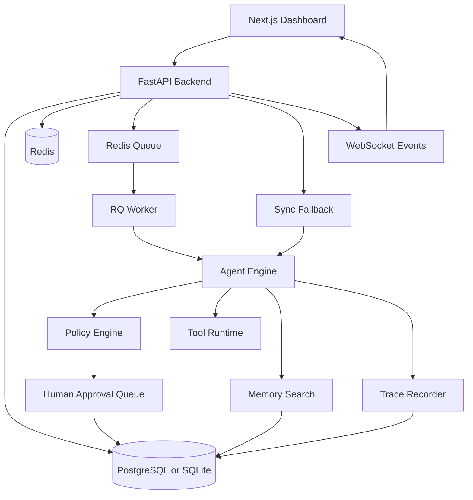
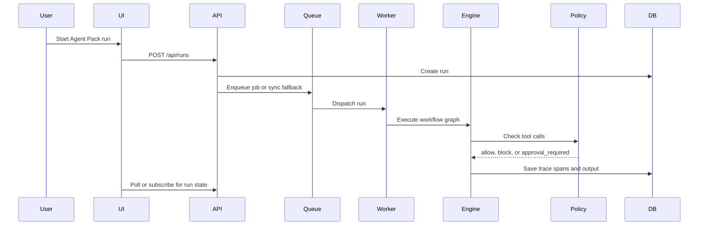

# AgentForge Studio

Self-hosted AgentOps studio for building, running, tracing, approving, evaluating, and extending multi-agent AI workflows.

AgentForge Studio is a full-stack portfolio project, not a mock landing page. It includes a Next.js dashboard, FastAPI backend, SQLAlchemy persistence, queue-aware execution path, reusable Agent Pack YAML format, tool runtime, policy guardrails, human approval queue, trace timeline, memory indexing, and rule-based evaluation lab.

<p>
  
  
  
  
  
  
  
</p>


## About

Most agent demos hardcode one prompt chain. AgentForge Studio is built around **Agent Packs**: portable YAML definitions that describe agents, workflow graph, tools, memory behavior, policies, and evaluation cases. The goal is to make multi-agent systems inspectable, repeatable, testable, and safer to operate locally.

The app ships with five working packs:

- Research Team
- Customer Feedback Intelligence Team
- Coding Review Team
- Document Review Team
- Sales Outreach Team

## Proof It Runs

The screenshots below were captured from the running application on June 26, 2026 using the included screenshot capture script.

Validation performed locally:

| Check | Result |
|---|---:|
| Backend compile | Passed |
| Agent Pack validation | 5 packs passed |
| Backend tests | 10 passed |
| Local evaluation smoke test | 5/5 passed |
| Frontend production build | Passed |
| UI screenshot capture | 12 screenshots saved |

Notes:

- The demo screenshots use SQLite, sync queue mode, and the mock LLM provider so the project can run without Docker, Redis, or API keys.
- Docker Compose deployment is included for PostgreSQL, Redis, backend, worker, frontend, and optional Ollama.
- `npm audit` currently reports two moderate PostCSS advisories through Next.js. The critical Next.js advisories were removed by upgrading to Next `15.5.19`.

## Screenshots

| Dashboard | Templates |
|---|---|
|  |  |

| Agent Packs | Pack Builder |
|---|---|
|  |  |

| Workflow Designer | Run Console |
|---|---|
|  |  |

| Trace Viewer | Evaluation Lab |
|---|---|
|  |  |

| Approval Queue | Tool Permissions |
|---|---|
|  |  |

| Memory Manager | Settings |
|---|---|
|  |  |

## System Architecture

AgentForge Studio has four main layers:

| Layer | Responsibility |
|---|---|
| Next.js dashboard | Operator UI for packs, workflow graph, runs, traces, approvals, tools, memory, evals, and settings |
| FastAPI backend | REST API, WebSocket events, pack validation, database models, seeding, health checks, metrics |
| Agent runtime | Agent Pack parser, workflow runner, provider abstraction, policy engine, trace writer, evaluator |
| Infrastructure | PostgreSQL or SQLite, Redis/RQ queue, worker process, local storage, Docker Compose |



## Workflow Lifecycle



## Feature Matrix

| Capability | Status |
|---|---:|
| FastAPI API | Implemented |
| Next.js dashboard | Implemented |
| SQLAlchemy persistence | Implemented |
| Built-in Agent Packs | Implemented |
| YAML pack validation | Implemented |
| Queue-aware run execution | Implemented |
| Sync local fallback | Implemented |
| Tool registry and permissions | Implemented |
| Policy allow/block/approval flow | Implemented |
| Human approval queue | Implemented |
| Trace timeline | Implemented |
| Rule-based evaluation lab | Implemented |
| Memory upload and keyword search | Implemented |
| Prometheus-compatible metrics | Implemented |
| Drag-and-drop workflow editing | Partial |
| Auth, RBAC, multi-tenancy | Planned |
| Vector search with pgvector | Planned |

## Quick Start

### Docker Compose

```bash
cp .env.example .env
docker compose up --build
```

Open:

```text
http://localhost:3000
```

API docs:

```text
http://localhost:8000/docs
```

Stop and remove local volumes:

```bash
docker compose down -v
```

### Local Lightweight Mode

Use this when Docker, Redis, or PostgreSQL are not available.

```bash
pip install -r backend/requirements.txt

PYTHONPATH=. \
DATABASE_URL=sqlite:///./agentforge.db \
QUEUE_EXECUTION_MODE=sync \
LLM_PROVIDER=mock \
python -m uvicorn backend.app.main:app --host 127.0.0.1 --port 8000
```

In another terminal:

```bash
cd frontend
npm install
NEXT_PUBLIC_API_URL=http://127.0.0.1:8000 npm run dev
```

## Useful Commands

```bash
python -m py_compile backend/app/main.py
python scripts/validate_packs.py
pytest backend/tests -q
python evals/run_local_eval.py
docker compose config
```

Frontend:

```bash
cd frontend
npm install
npm run build
npm run screenshots
```

## Screenshot Capture

Screenshots are reproducible through Playwright and the installed browser on the machine.

```bash
cd frontend
APP_URL=http://127.0.0.1:3000 API_URL=http://127.0.0.1:8000 npm run screenshots
```

Saved files are written to:

```text
docs/screenshots/
```

## API Surface

| Area | Endpoints |
|---|---|
| Health | `/health`, `/ready`, `/metrics` |
| Packs | `GET/POST /api/packs`, `GET/PUT/DELETE /api/packs/{id}`, import, export, validate |
| Runs | `POST /api/runs`, `GET /api/runs`, `GET /api/runs/{id}`, retry, stop, output |
| Traces | `GET /api/runs/{id}/traces`, `GET /api/traces/{span_id}` |
| Approvals | `GET /api/approvals`, approve, reject |
| Tools | `GET /api/tools`, `PUT /api/tools/{name}/permissions` |
| Evaluations | `POST /api/evals/run`, history, Markdown report export |
| Files and memory | upload, list, delete, index, search |
| Live events | `/ws/runs/{run_id}` |

## Agent Pack Example

```yaml
name: "Research Team"
version: "1.0.0"
description: "Multi-agent research workflow with source verification and report writing."
models:
  default_provider: "openai_compatible"
  default_model: "gpt-4o-mini"
agents:
  - id: "planner"
    name: "Planner Agent"
    role: "Breaks user request into subtasks"
    goal: "Create a clear plan for other agents"
    tools: []
workflow:
  type: "supervisor_workers"
  start: "planner"
  nodes: ["planner", "researcher", "critic", "writer"]
  edges:
    - from: "planner"
      to: "researcher"
tools:
  - "file_reader"
  - "web_search"
  - "markdown_report"
  - "memory.search"
policies:
  require_approval:
    - "web_search"
  blocked:
    - "secret.read"
evaluation:
  cases_file: "eval_cases.json"
```

## Security Model

Implemented local safeguards:

- API keys stay backend-side and are never exposed to the frontend.
- Dangerous tools can be blocked by policy.
- Risky tools can require human approval before execution.
- Email and GitHub tools produce drafts instead of performing destructive actions.
- Tool calls, approval decisions, and policy checks are written to trace spans.
- Uploaded filenames are sanitized.
- File upload size is configurable.
- Runs have step and cost guardrails.
- Code execution uses a constrained Python subprocess timeout.
- Current no-auth mode is for trusted local development only.

Planned hardening:

- Authentication and RBAC
- Workspace isolation
- Secrets manager integration
- Stronger sandboxing for code execution
- Rate limiting and audit export
- Multi-user deployment mode

## Repository Map

```text
AgentForge-Studio/
  backend/              FastAPI API, SQLAlchemy models, routers, services
  frontend/             Next.js TypeScript dashboard and screenshot tooling
  agent_engine/         Pack schema, runner, provider abstraction, policy, evaluator
  tools/                Tool runtime implementations
  packs/                Built-in Agent Pack templates
  sample_data/          CSV, Markdown, and text demo data
  evals/                Local evaluation runner
  docs/                 Architecture, safety, evaluation, deployment, screenshots
  scripts/              Validation and seed scripts
  worker.py             RQ worker entrypoint
  docker-compose.yml    Postgres, Redis, backend, worker, frontend, optional Ollama
```

## Roadmap

1. React Flow drag-and-drop graph editing with YAML round trip.
2. pgvector embeddings and hybrid retrieval.
3. Durable resume state for approval pauses.
4. OpenTelemetry traces and Grafana dashboard.
5. Workspace auth, RBAC, and audit logs.
6. Signed Agent Pack import/export.
7. Optional LLM-as-judge evaluation with calibrated rubrics.
8. Containerized code sandbox.
9. Provider/model cost accounting.
10. Multi-user deployment mode.

## Portfolio Positioning

This project demonstrates practical full-stack AI systems engineering:

- agent workflow design
- backend API architecture
- frontend dashboard implementation
- policy and approval guardrails
- observability and trace modeling
- evaluation methodology
- Docker-based deployment design
- reproducible screenshots and validation artifacts
